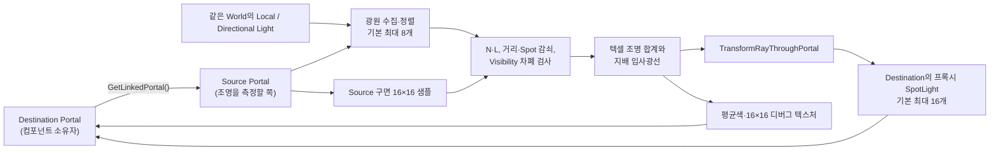

# 포탈 조명 전달 CPU PoC 구현 기록

> 상태: 2026-07-10 기준으로 PoC 구현은 제거되었다. 이 문서는 실험의 구조, 관찰된 한계, 제거 범위를 보존하기 위한 기록이며 현재 플러그인의 지원 기능이나 API 명세가 아니다.

## 목적과 결론

이 PoC는 링크된 포탈 주변의 직접광을 CPU에서 근사한 뒤, 반대편 포탈에 런타임 프록시 광원을 만들어 빛이 포탈을 통과한 것처럼 보이게 할 수 있는지 확인했다. 최종 실험 구현은 `UWPPortalLightTransferComponent` 하나에 광원 수집, 구면 샘플링, 차폐 검사, 디버그 표시, 프록시 광원 생성을 모두 묶었다.

실험으로 방향성을 전달하는 시각 효과는 만들 수 있었지만, 결과는 물리 기반 광 전달이 아니라 여러 개의 `SpotLight`로 직접광을 다시 비추는 근사였다. CPU 차폐 트레이스 비용, 프록시 광원의 불연속성, 실제 광 에너지와 맞지 않는 단위 및 간접광 부재 때문에 일반 기능으로 유지하지 않고 제거했다.

## Source와 Destination의 의미

이 구현에서 Source와 Destination은 포탈의 고정된 정체성이 아니라 **한 컴포넌트 인스턴스의 조명 데이터 흐름**을 뜻한다.

- **Destination Portal**: `UWPPortalLightTransferComponent`의 소유자다. 프록시 `PointLight`/`SpotLight`와 디버그 평면은 이 포탈 쪽에 생성된다. 레벨 PoC에서는 PortalA에 컴포넌트가 있었다.
- **Source Portal**: `DestinationPortal->GetLinkedPortal()`로 얻은 링크 상대다. 주변 광원을 수집하고 포탈 구면을 샘플링하는 쪽이다.
- 따라서 PortalA에만 컴포넌트가 있다면 조명은 PortalA의 링크 상대에서 PortalA 방향으로만 평가된다. 양방향 전달을 원했다면 각 포탈에 별도 컴포넌트가 필요했다.

`TransformRayThroughPortal`은 Source 표면으로 들어오는 광선의 시작점과 방향을 Source의 링크 상대인 Destination 공간으로 변환한다. 이 함수 자체는 Line Trace를 실행하지 않으며, 구 외부에서 안쪽으로 들어오는 광선만 성공하도록 제한되어 있다.

## 최종 컴포넌트 방식

### 갱신 주기와 수명

`BeginPlay`에서 런타임 리소스를 만들고 즉시 한 번 갱신했다. 이후 기본 `UpdateRateHz=10`으로 0.1초마다 `ForceUpdatePortalLight`를 호출했다. `UpdateRateHz <= 0`이면 매 Tick 갱신했다. 컴포넌트를 비활성화하거나 유효한 Destination/Source가 없으면 프록시 광원의 Intensity를 0으로 만들었고, `EndPlay`에서는 생성한 컴포넌트와 텍스처를 해제했다.

생성된 `PointLight`, `SpotLight`, 디버그 평면, 동적 머티리얼, 텍스처는 모두 Transient 런타임 리소스였다. 프록시에는 `WPPortalProxyLight` 태그를 붙여 다음 수집에서 자기 자신이 다시 입력광으로 들어오는 피드백을 막았다.

### 1. Source 광원 수집

매 갱신마다 `TObjectIterator`로 같은 World의 `ULocalLightComponent`와, 옵션이 켜져 있으면 `UDirectionalLightComponent`를 탐색했다.

- 등록되지 않았거나 보이지 않거나 `bAffectsWorld=false`인 광원은 제외했다.
- Source/Destination 포탈이 소유한 광원과 `WPPortalProxyLight` 태그의 로컬 광원은 제외했다.
- 로컬 광원은 Source 중심에서 유효 수집 반경 밖이면 제외했다. 코드상 유효 반경은 설정값과 무관하게 최소 10,000 uu였다.
- 로컬 광원은 밝기에 거리 가중치를 곱해 정렬했고, Directional Light는 스케일 적용 밝기로 정렬했다.
- 두 종류를 합친 뒤 밝은 순서로 기본 최대 8개만 평가했다.

`IsActive()`가 false인 광원은 진단 카운터에는 기록했지만 실제 제외 조건으로 사용하지 않았다. 이는 PoC 구현의 알려진 상태 판정 한계다.

### 2. 16×16 구면 샘플과 광원 평가

Source 포탈의 반지름을 이용해 위도·경도 방식으로 전체 구면에 기본 16×16, 즉 256개의 표면점과 법선을 만들었다. 각 텍셀에서 선택된 모든 광원의 직접광을 다음처럼 합산했다.

- 기본은 단면 수광이며 `N·L`이 양수인 광만 받았다. Double-sided 옵션에서는 `abs(N·L)`을 사용했다.
- 로컬 광원은 광원 `AttenuationRadius`와 Source 수집 반경 중 작은 값을 유효 반경으로 사용하고, `(1 - distance / radius)^2`의 자체 거리 감쇠를 적용했다.
- `SpotLight`는 Inner/Outer Cone 사이를 제곱 보간한 추가 감쇠를 적용했다. 그 밖의 Local Light는 위치 기반 점광원처럼 근사했다.
- `AffectsBounds`로 해당 표면점에 영향을 주지 않는 로컬 광원을 거른 뒤 차폐 Line Trace를 실행했다.
- Directional Light는 거리 감쇠 없이 설정 스케일과 `N·L`을 적용하고, 광원 반대 방향으로 고정 거리 차폐 Trace를 실행했다.
- 차폐 Trace는 기본 `ECC_Visibility`를 사용하며 Source 포탈, Destination 포탈, 광원 소유자를 무시했다.

각 텍셀의 색은 모든 유효 광원의 합이지만, 전달 방향은 그 텍셀에서 가장 기여도가 큰 **한 광원**의 입사 방향만 보존했다. 전체 텍셀 색의 산술 평균은 `LastAggregatedColor`로 저장했다.

### 3. Destination 프록시 재방출

기본 출력은 방향성 프록시 방식이었다. 빛이 있는 각 텍셀의 지배 입사광선을 `SourcePortal->TransformRayThroughPortal`로 Destination 공간에 옮기고, 밝은 후보 순으로 최대 16개를 골랐다. 각 후보는 Destination 표면에서 기본 8 uu 떨어진 위치에 Movable `USpotLightComponent`로 배치되며 변환된 출사 방향을 바라봤다.

프록시 `SpotLight`의 색은 텍셀 RGB를 최대 채널로 정규화하고, Intensity는 최대 채널에 스케일을 곱해 정했다. 기본 Cone은 Inner 5도/Outer 20도, Attenuation Radius는 1,000 uu였다. 프록시는 그림자, Global Illumination 기여, Reflection 기여를 모두 껐다.

전체 평균색을 포탈 중심의 `PointLight` 하나로 재방출하는 경로도 있었지만 `bUseAverageProxyLight=false`가 기본이었다. 이 경로를 켜면 평균색 최대 채널에 스케일 2를 적용하고, 빛이 감지됐을 때 최소 Intensity 500을 보장했다.

## C++ 기본 설정

아래 값은 제거 직전 `UWPPortalLightTransferComponent`의 C++ 멤버 초기값이다. 레벨 인스턴스가 별도로 덮어쓴 값과는 다를 수 있다.

| 영역 | 설정 | 기본값 | 의미 및 주의점 |
|---|---|---:|---|
| 실행 | `bEnablePortalLightTransfer` | `true` | 전체 PoC 활성화 |
| 실행 | `TextureResolution` | `16` | 구면 샘플 및 디버그 텍스처 한 변; 런타임 Clamp 4~128 |
| 실행 | `UpdateRateHz` | `10.0` | 초당 갱신 횟수; 0 이하는 매 Tick |
| 입력 | `SourceGatherRadius` | `10000.0` | 로컬 광원 수집 반경; 구현상 최소 유효값도 10,000 uu |
| 입력 | `MaxSourceLights` | `8` | Local/Directional 통합 평가 상한; 런타임 Clamp 1~32 |
| 입력 | `bIncludeDirectionalLights` | `true` | Directional Light 수집 여부 |
| 입력 | `LocalLightContributionScale` | `1.0` | 로컬 광 기여 스케일 |
| 입력 | `DirectionalLightContributionScale` | `1000.0` | Directional 광 기여 스케일; 물리 단위 보정이 아닌 경험값 |
| 수광 | `bDoubleSidedPortalReceiver` | `false` | false면 앞면 `N·L > 0`만 수광 |
| 차폐 | `OcclusionTraceChannel` | `ECC_Visibility` | Source 쪽 차폐 Trace 채널 |
| 차폐 | `DirectionalOcclusionTraceDistance` | `5000.0` | Directional Light 차폐 검사 거리 |
| 평균 프록시 | `bUseAverageProxyLight` | `false` | Destination 중심 PointLight 사용 여부 |
| 평균 프록시 | `ProxyLightIntensityScale` | `2.0` | 평균색 최대 채널의 Intensity 배율 |
| 평균 프록시 | `MinimumProxyIntensityWhenLit` | `500.0` | 평균 프록시가 켜졌을 때 최소 Intensity |
| 공통 프록시 | `ProxyLightAttenuationRadius` | `1000.0` | Point/Spot 프록시 감쇠 반경 |
| 방향 프록시 | `bUseDirectionalProxyLights` | `true` | 텍셀 방향 기반 SpotLight 사용 여부 |
| 방향 프록시 | `MaxDirectionalProxyLights` | `16` | 밝은 텍셀 후보의 SpotLight 상한; 런타임 Clamp 0~64 |
| 방향 프록시 | `DirectionalProxyInnerConeAngle` | `5.0` | SpotLight Inner Cone(도) |
| 방향 프록시 | `DirectionalProxyOuterConeAngle` | `20.0` | SpotLight Outer Cone(도) |
| 방향 프록시 | `DirectionalProxySurfaceOffset` | `8.0` | Destination 표면에서 출사 방향으로 띄우는 거리 |
| 방향 프록시 | `DirectionalProxyIntensityScale` | `1.0` | 텍셀 최대 채널의 SpotLight Intensity 배율 |
| 디버그 | `bShowDebugTexturePlane` | `true` | Destination 옆 디버그 평면 표시 |
| 디버그 | `DebugTextureExposure` | `0.0025` | 텍스처 및 센서 포인트 표시용 지수 노출 |
| 디버그 | `bUseDiagnosticDebugColors` | `true` | 실패 상태를 체크 패턴으로 표시 |
| 디버그 | `bDrawDebugSensorSamples` | `true` | Source 구면의 256개 디버그 포인트 표시 |
| 디버그 | `bLogDebugState` | `true` | 광원 수, 유효 텍셀, 평균색, 프록시 수 등 기록 |

## 디버그 출력

### 집계 텍스처와 평면

`AggregatedPortalLightTexture`는 기본 16×16 `PF_B8G8R8A8` Transient 텍스처였다. SRGB, Nearest Filter, No Mipmaps로 만들고 각 텍셀의 선형 조명을 `1-exp(-lighting*exposure)`로 표시색에 매핑했다.

Destination 옆에는 엔진 기본 Plane과 `/Game/WormholePortal/Material/M_TempPortalRender`의 동적 인스턴스를 사용한 평면을 띄웠다. 텍스처는 머티리얼의 `PortalTexture`, `Texture`, `SlateUI` 파라미터에 모두 지정해 실험 중 머티리얼 파라미터 차이를 흡수했다. 이 평면은 진단용일 뿐 실제 포탈 렌더링 표면이 아니었다.

진단색을 켠 경우 다음 체크 패턴을 사용했다.

| 상태 | 표시 |
|---|---|
| 링크된 Source 포탈 없음 | 파랑/청록 |
| 수집된 Source 광원 없음 | 빨강/주황 |
| 광원은 있지만 빛을 받은 텍셀 없음 | 노랑/검정 |
| 정상 평가 | 노출을 적용한 텍셀별 조명색 |

### 센서 포인트와 로그

Source 구면에는 같은 16×16 위치에 텍셀 조명색의 `DrawDebugPoint`를 그렸다. 기본 10 Hz에서는 다음 갱신까지 보이도록 약 0.125초간 유지했다.

로그에는 Destination/Source 이름, 선택된 광원 수, 유효 텍셀 수, 평균 RGB, 평균 프록시 Intensity, 활성 방향 프록시 수와 광원 필터링 진단을 남겼다. 기본 설정에서는 약 1초에 한 번 출력했지만 `UpdateRateHz <= 0`의 매 Tick 경로에서는 사실상 매 갱신 로그가 가능했다.

## 성능 특성

포탈 조명 컴포넌트 하나의 갱신 비용은 대략 다음과 같다.

- 광원 수집: World에 존재하는 모든 Local/Directional Light를 순회한다.
- 텍셀 평가: `TextureResolution² × 선택 광원 수`다.
- 차폐: 기여 조건을 통과한 텍셀-광원 쌍마다 CPU `LineTraceSingleByChannel`을 최대 한 번 실행한다.
- 디버그: 기본으로 256개 포인트를 그리고 256픽셀 텍스처를 CPU에서 갱신한다.
- 출력: 후보를 정렬하고 최대 16개의 Movable SpotLight 상태를 갱신한다.

기본 16×16, 최대 광원 8개에서는 갱신당 최대 약 2,048개의 텍셀-광원 평가 및 차폐 Trace 후보가 생기고, 10 Hz라면 초당 최대 약 20,480개다. 조건 검사에서 일찍 제외되는 쌍은 Trace하지 않지만, 여러 포탈에 컴포넌트를 붙이면 비용이 거의 선형으로 늘어난다. 최대 해상도 128에서는 같은 광원 8개만으로도 갱신당 131,072개 쌍이 되어 실시간 기능으로 사용하기 어렵다.

프록시 광원을 처음 만들 때 컴포넌트 등록 비용이 들고, 이후에도 여러 Movable Light의 조명 범위가 겹치면 GPU 조명 비용이 증가한다. 그림자/GI/Reflection을 끈 것은 이 비용과 피드백을 줄이기 위한 선택이었다.

## 비물리적 근사와 한계

- 구면 전체를 위도·경도 격자로 샘플링한다. 샘플이 등면적이 아니고 평균에도 면적 가중치를 쓰지 않아 극점 부근이 과대표현된다.
- 포탈을 통과하는 Radiance나 입체각을 적분하지 않는다. 텍셀 RGB를 Unreal Light Intensity로 직접 옮기며, 특히 Directional 스케일 1,000과 최소 Point Intensity 500은 경험적 보정값이다.
- 직접광만 다루며 간접광, 반사, 굴절, 투과, Emissive, Area Light의 실제 형상은 전달하지 않는다. Spot 이외의 Local Light는 위치 기반 광원으로 단순화된다.
- 한 텍셀의 색은 여러 광원 합이지만 출사 방향은 가장 강한 한 광원만 사용한다. 여러 방향에서 들어온 에너지가 한 SpotLight 방향으로 합쳐질 수 있다.
- 밝은 텍셀 상위 16개만 프록시로 만든다. 인접 텍셀이 같은 광원을 중복 재방출할 수 있고, 순위가 바뀔 때 프록시가 튀거나 깜빡일 수 있다.
- Source 쪽 차폐만 검사한다. Destination 쪽 지오메트리 차폐는 SpotLight의 그림자를 껐기 때문에 재현되지 않는다.
- 포탈 반대편에서 새 광원을 만드는 방식이므로 에너지 보존, 광량 단위, 노출 변화와 일치하지 않는다. 실제 원본 조명과 프록시 범위가 겹치면 이중 조명이 생길 수 있다.
- `TransformRayThroughPortal`이 구 외부에서 안쪽으로 들어오는 광선만 처리하므로 그 조건을 만족하지 않는 텍셀 후보는 버려진다.
- 광원 상태 수집에서 `IsActive()==false`를 제외하지 않는 등 프로덕션용 상태/수명 관리가 완전하지 않았다.

## 폐기된 Subsystem 시도

컴포넌트 방식 이전에는 `UWPPortalLightTransferSubsystem`을 중심으로 한 별도 시도가 있었다. 소스는 최종 작업 트리에 남아 있지 않았고, 제거 전 `Intermediate` 오브젝트와 의존성 파일에서 다음 구조를 확인할 수 있었다.

- Game/PIE World에서 Tick하는 `UWPPortalLightTransferSubsystem`
- 포탈 주변 `PointLight`를 검색하고 점수화하는 `FindRelevantPointLightsNearPortal`/`ScorePointLightForPortal`
- `UWPPortalLightProxyComponent`를 찾거나 만들고 동기화하는 `FindOrCreateProxy`/`SyncPointLightProxy`
- 전체 재구축, 비활성화, 오래된 프록시 정리를 담당하는 `RebuildPortalLightTransfers`/`DisableAllPortalLightTransfers`/`DisableStaleProxies`
- Source/Virtual 위치와 방향 등을 담았던 `FWPPortalLightTransferData`

즉, 초기 시도는 World Subsystem이 포탈과 PointLight를 중앙에서 매칭하고 프록시를 유지하는 방식이었다. 이후 최종 PoC는 Destination 포탈별 컴포넌트가 Source 구면을 샘플링하고 방향성 SpotLight를 만드는 방식으로 달라졌다. Subsystem 관련 파일과 심볼은 현재 기능으로 간주하지 않으며, 오래된 `Intermediate`나 `UnrealEditor-WormholePortal.dll`에서 복원해서는 안 된다.

## 제거된 항목

이번 정리에서 다음 PoC 전용 항목을 제거했다.

- 구 `WormholePortal` 모듈 경로의 `WPPortalLightTransferComponent.h/.cpp`와 비어 있는 모듈 디렉터리
- 레벨의 PortalA External Actor에 직렬화되어 있던 `PortalLightTransfer` 컴포넌트 인스턴스 한 개
- PoC 입력광으로 추가했던 SpotLight External Actor `Content/__ExternalActors__/ThirdPerson/Lvl_ThirdPerson/D/FZ/WITD50Q2LDUIQVE98W2XYN.uasset`
- 구 `WormholePortal` 모듈의 ignored `Binaries`/`Intermediate` 산출물과 `UnrealEditor-WormholePortal.dll`
- 비공식 Blueprint/C++ 인터페이스 `ForceUpdatePortalLight`, `GetAggregatedPortalLightTexture`, `GetLastAggregatedColor`, `GetLastDirectionalProxyLightCount` 및 위 설정 프로퍼티
- 런타임에만 생성되던 프록시 PointLight/SpotLight, 집계 텍스처, 디버그 평면과 조명 전달 로그

## 유지된 포탈 기능

조명 전달 PoC는 일반 포탈 시스템과 분리해 제거했다. 다음 항목은 유지 대상이다.

- `WormholePortalRuntime` 및 `WormholePortalEditor` 모듈과 지원 중인 Runtime API
- 포탈 렌더링, 링크 설정, 충돌/Overlap, 통과 및 Twin 처리
- `AWormholePortalActor::TransformRayThroughPortal`
- 레벨의 T키 포탈 트레이스 디버그
- `M_TempPortalRender`, Portal Blueprint와 기존 DirectionalLight
- `DefaultEngine.ini`의 포탈 Trace 채널 설정과 구 모듈에서 Runtime 모듈로의 Core Redirect
- PortalA의 Transform, `LinkedPortal`, 그 밖의 기존 컴포넌트와 로컬 변경

정리 후의 기준은 Source, Content, 생성물 어디에도 `WPPortalLightTransferComponent`, `PortalLightTransfer`, 구 `UnrealEditor-WormholePortal.dll` 참조가 남지 않으면서 위 일반 포탈 기능이 Editor/Game 빌드, 패키지 로드, Blueprint 컴파일 및 PIE에서 계속 동작하는 것이다.
